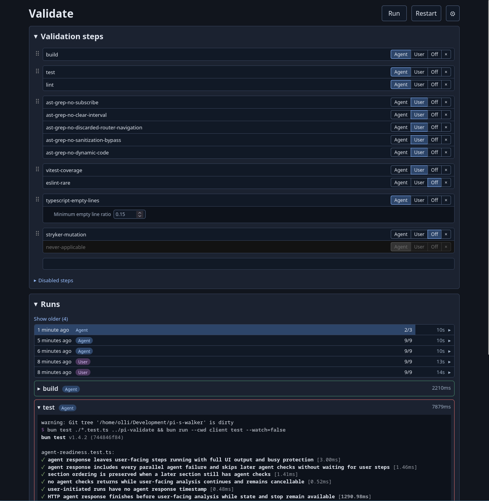

# Motivation

The grand vision for the project was to have a tool that discovers possible software analyzers to use, lets me write more of them and lets me decide which are enabled.
Agents simply run the **validate** tool to receive the issues found by the analyzers.  

The backstory is that I wanted to have a single place to write software analyzers and control how they run.
This repository is an attempt at that with an analysis runner **validate** and **pi-validate**, an extension that bridges Pi to it.

The program allows adding and viewing happy and unhappy outputs.
It also lets me designate which unhappy outputs go to the agent. 
Basic web UI for now.

The analysis runner lives in `validate/`, and the Pi extension lives in `pi-validate/`.

Disclaimer: I have used LLMs to help write the code.

# Web UI

